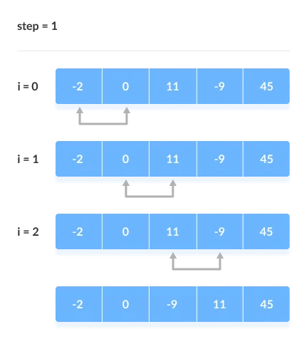
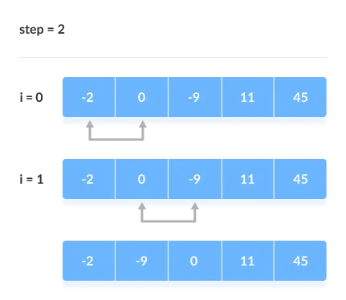
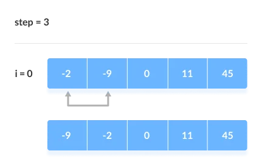

# Bubble Sort

**Bubble sort** is a sorting algorithm that compares two adjacent elements and swaps them until they are not in the intended order.

Just like the movement of air bubbles in the water that rise up to the surface, each element of the array move to the end in each iteration. Therefore, it is called a bubble sort.

### Working of Bubble Sort

Suppose we are trying to sort the elements in **ascending order**.

**1. First Iteration (Compare and Swap)**

1. Starting from the first index, compare the first and the second elements.
2. If the first element is greater than the second element, they are swapped.
3. Now, compare the second and the third elements. Swap them if they are not in order.
4. The above process goes on until the last element.

**2. Remaining Iteration**

The same process goes on for the remaining iterations.

After each iteration, the largest element among the unsorted elements is placed at the end.

In each iteration, the comparison takes place up to the last unsorted element.

The array is sorted when all the unsorted elements are placed at their correct positions.

### Implementation

    void bubbleSort(vector<int>& array) {
        for (int i = 0; i < array.size(); i++)
            for (int j = 0; j < array.size() - i; j++)
                if (array[j] > array[j + 1])
                    swap(array[j], array[j + 1]);
    }

### Time complexity

The number of comparisons that we will perform using bubble sort algorithm is (n-1) + (n-2) + (n-3) +.....+ 1 = n(n-1)/2, hence the time complexity will be *O*(N^2).