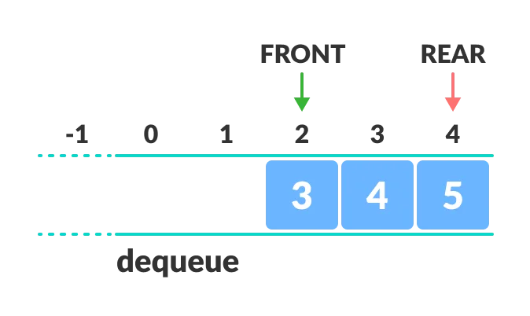
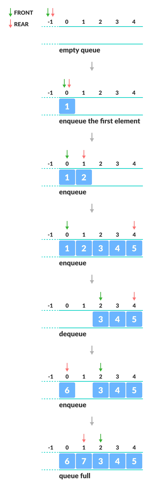

# Circular Queue Data Structure

A circular queue is the extended version of a [regular queue][1] where the last element is connected to the first element. Thus forming a circle-like structure.

The circular queue solves the major limitation of the normal queue. In a normal queue, after a bit of insertion and deletion, there will be non-usable empty space.

Here, indexes **0** and **1** can only be used after resetting the queue (deletion of all elements). This reduces the actual size of the queue.

---

### How Circular Queue Works

Circular Queue works by the process of circular increment i.e. when we try to increment the pointer and we reach the end of the queue, we start from the beginning of the queue.

Here, the circular increment is performed by modulo division with the queue size. That is,

    if REAR + 1 == 5 (overflow!), REAR = (REAR + 1)%5 = 0 (start of queue)
---

### Circular Queue Operations

The circular queue work as follows:

* two pointers `FRONT` and `REAR`
* `FRONT` track the first element of the queue
* `REAR` track the last elements of the queue
* initially, set value of `FRONT` and `REAR` to -1

**1. Enqueue Operation**

* check if the queue is full
* for the first element, set value of `FRONT` to 0
* circularly increase the `REAR` index by 1 (i.e. if the rear reaches the end, next it would be at the start of the queue)
* add the new element in the position pointed to by `REAR`

**2. Dequeue Operation**

* check if the queue is empty
* return the value pointed by `FRONT`
* circularly increase the `FRONT` index by 1
* for the last element, reset the values of `FRONT` and `REAR` to -1

However, the check for full queue has a new additional case:

* Case 1: `FRONT` = 0 && `REAR == SIZE - 1`
* Case 2: `FRONT = REAR + 1`

The second case happens when `REAR` starts from 0 due to circular increment and when its value is just 1 less than `FRONT`, the queue is full.

---
### Implementation

The most common queue implementation is using arrays, but it can also be implemented using lists.

    struct Queue {
        vector<int> items; 
        int front, rear, size;

        Queue(int size) {
            this->items.resize(size);
            this->front = -1;
            this->rear = -1;
            this->size = size;
        }
        // Check if the queue is full
        bool isFull() {
            if (this->front == 0 && this->rear == this->size - 1) return true;
            if (this->front == this->rear + 1) return true;
            return false;
        }
        // Check if the queue is empty
        bool isEmpty() {
            if (this->front == -1) return true;
            else return false;
        }
        // Adding an element
        void enQueue(int element) {
            if (isFull()) cout << "Queue is full";
            else {
                if (this->front == -1) this->front = 0;
                this->rear = (this->rear + 1) % this->size;
                this->items[this->rear] = element;
                cout << "Inserted " << element << endl;
            }
        }
        // Removing an element
        int deQueue() {
            int element;
            if (isEmpty()) {
                cout << "Queue is empty" << endl;
                return (-1);
            } else {
                element = this->items[this->front];
                if (this->front == this->rear) {
                    this->front = -1;
                    this->rear = -1;
                }
                // Q has only one element,
                // so we reset the queue after deleting it.
                else this->front = (this->front + 1) % this->size
                return element;
            }
        }
    };
---

### Circular Queue Complexity Analysis

The complexity of the enqueue and dequeue operations of a circular queue is `O(1)` for (array implementations).

---

### Applications of Circular Queue

* CPU scheduling
* Memory management
* Traffic Management