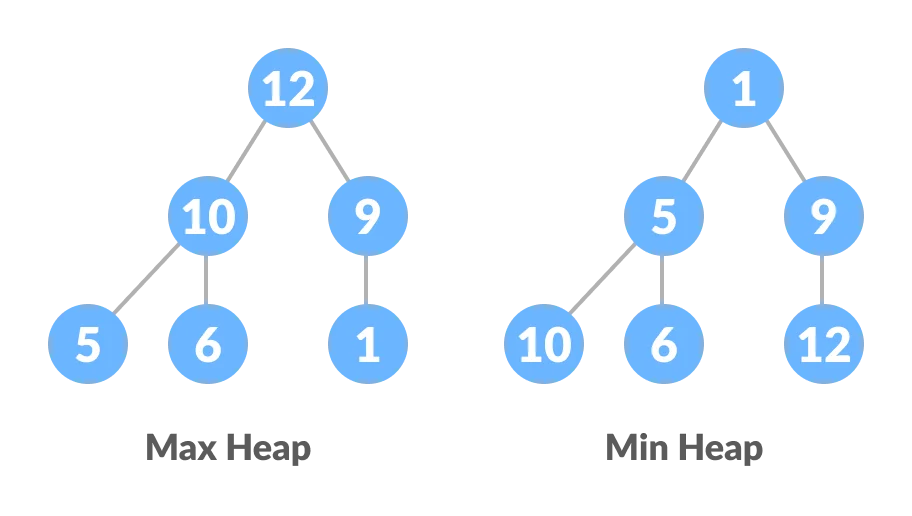
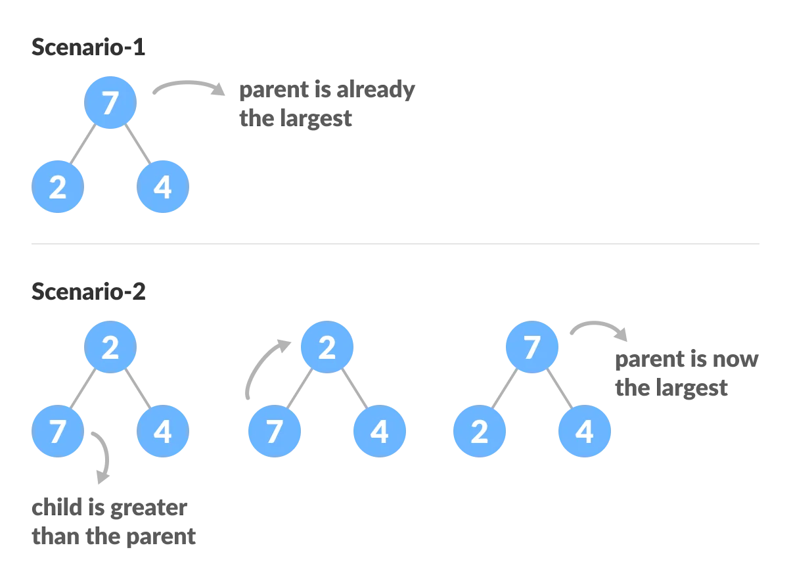
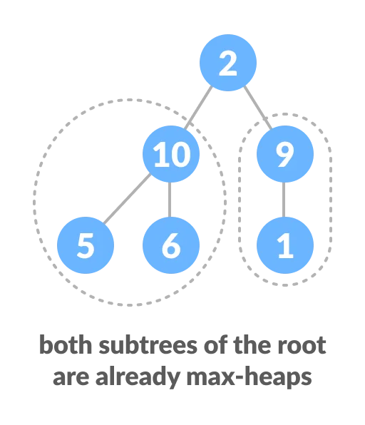
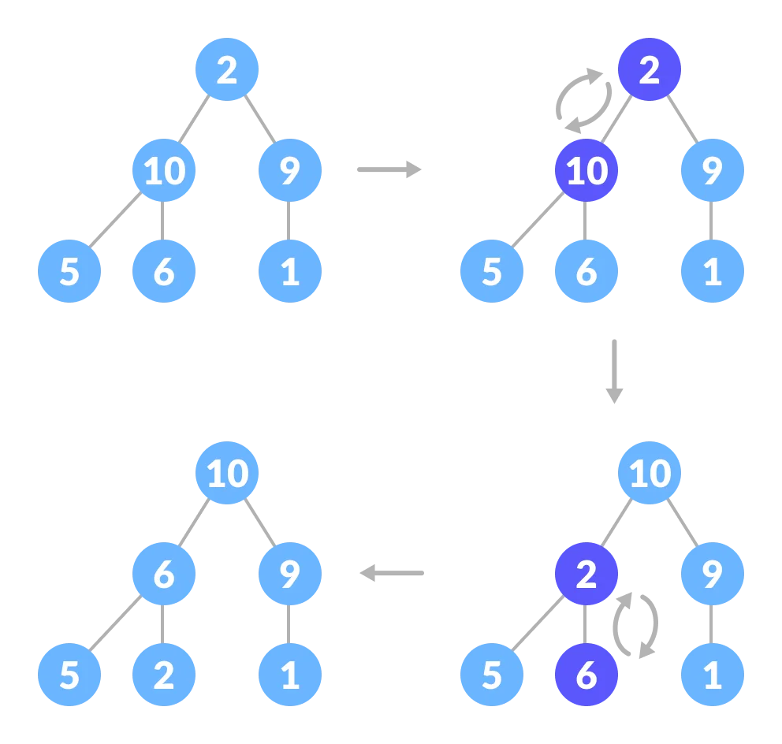
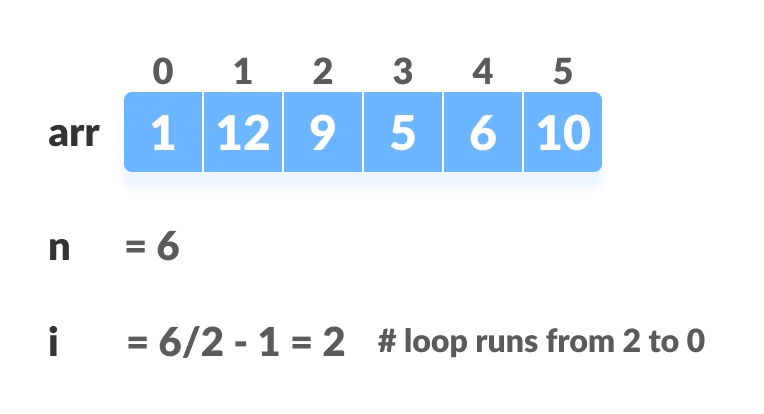
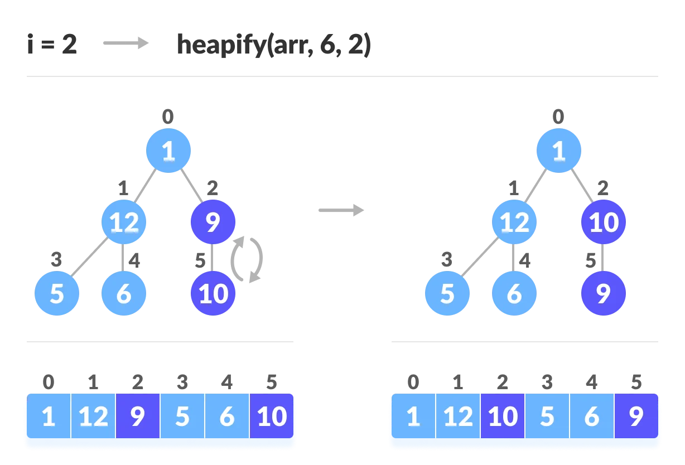
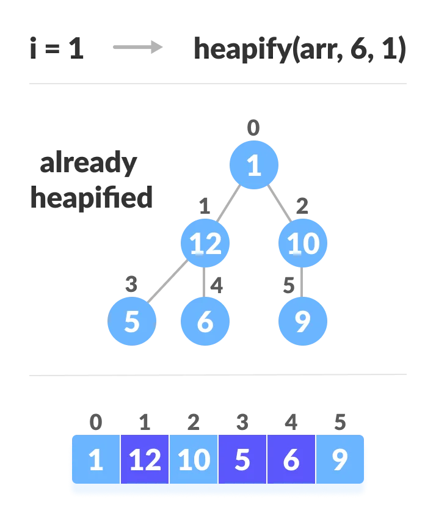
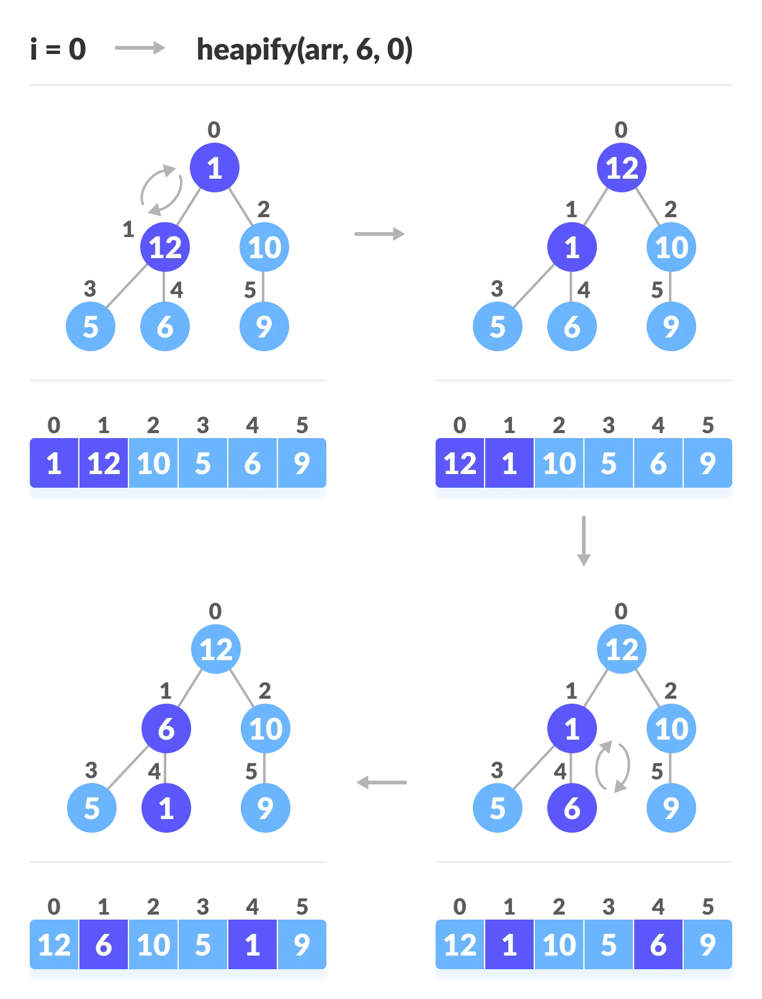

# Heap Sort

**Heap Sort** is a popular and efficient sorting algorithm in computer programming. Learning how to write the heap sort algorithm requires knowledge of two types of data structures - arrays and trees.

The initial set of numbers that we want to sort is stored in an array e.g. `[10,3,76,34,23,32]` and after sorting, we get a sorted array `[3,10,23,32,34,76]`.

Heap sort works by visualizing the elements of the array as a special kind of complete binary tree called a heap.

> Note: As a prerequisite, you must know about a complete [binary tree][1] and [heap data structure][2].

### Relationship between Array Indexes and Tree Elements

A complete binary tree has an interesting property that we can use to find the children and parents of any node.

If the index of any element in the array is `i`, the element in the index `2i+1` will become the left child and element in `2i+2` index will become the right child. Also, the parent of any element at index `i` is given by the lower bound of `(i-1)/2`.

Let's test it out,

    Left child of 1 (index 0)
    = element in (2*0+1) index 
    = element in 1 index 
    = 12

    Right child of 1
    = element in (2*0+2) index
    = element in 2 index 
    = 9

    Similarly,
    Left child of 12 (index 1)
    = element in (2*1+1) index
    = element in 3 index
    = 5

    Right child of 12
    = element in (2*1+2) index
    = element in 4 index
    = 6

Let us also confirm that the rules hold for finding parent of any node

    Parent of 9 (position 2) 
    = (2-1)/2 
    = ½ 
    = 0.5
    ~ 0 index 
    = 1

    Parent of 12 (position 1) 
    = (1-1)/2 
    = 0 index 
    = 1

Understanding this mapping of array indexes to tree positions is critical to understanding how the Heap Data Structure works and how it is used to implement Heap Sort.

---

### What is Heap Data Structure?

Heap is a special tree-based data structure. A binary tree is said to follow a heap data structure if

* it is a complete [binary tree][1]
* All nodes in the tree follow the property that they are greater than their children i.e. the largest element is at the root and both its children and smaller than the root and so on. Such a heap is called a max-heap. If instead, all nodes are smaller than their children, it is called a min-heap

The following example diagram shows Max-Heap and Min-Heap.

To learn more about it, please visit [Heap Data Structure][2].

---
### How to "heapify" a tree

Starting from a complete binary tree, we can modify it to become a Max-Heap by running a function called heapify on all the non-leaf elements of the heap.

Since heapify uses recursion, it can be difficult to grasp. So let's first think about how you would heapify a tree with just three elements.

    heapify(array)
        Root = array[0]
        Largest = largest( array[0] , array [2*0 + 1]. array[2*0+2])
        if(Root != Largest)
            Swap(Root, Largest)

The example above shows two scenarios - one in which the root is the largest element and we don't need to do anything. And another in which the root had a larger element as a child and we needed to swap to maintain max-heap property.

If you're worked with recursive algorithms before, you've probably identified that this must be the base case.

Now let's think of another scenario in which there is more than one level.

The top element isn't a max-heap but all the sub-trees are max-heaps.

To maintain the max-heap property for the entire tree, we will have to keep pushing 2 downwards until it reaches its correct position.

Thus, to maintain the max-heap property in a tree where both sub-trees are max-heaps, we need to run heapify on the root element repeatedly until it is larger than its children or it becomes a leaf node.

We can combine both these conditions in one heapify function as

    void heapify(vector<int>& arr, int n, int i) {
        // Find largest among root, left child and right child
        int largest = i;
        int left = 2 * i + 1;
        int right = 2 * i + 2;

        if (left < n && arr[left] > arr[largest])
            largest = left;

        if (right < n && arr[right] > arr[largest])
            largest = right;

            // Swap and continue heapifying if root is not largest
            if (largest != i) {
            swap(arr[i], arr[largest]);
            heapify(arr, n, largest);
        }
    }

This function works for both the base case and for a tree of any size. We can thus move the root element to the correct position to maintain the max-heap status for any tree size as long as the sub-trees are max-heaps.

---

### Build max-heap

To build a max-heap from any tree, we can thus start heapifying each sub-tree from the bottom up and end up with a max-heap after the function is applied to all the elements including the root element.

In the case of a complete tree, the first index of a non-leaf node is given by n/2 - 1. All other nodes after that are leaf-nodes and thus don't need to be heapified.

So, we can build a maximum heap as

    // Build heap (rearrange array)
    for (int i = n / 2 - 1; i >= 0; i--)
      heapify(arr, n, i);
    

As shown in the above diagram, we start by heapifying the lowest smallest trees and gradually move up until we reach the root element.

If you've understood everything till here, congratulations, you are on your way to mastering the Heap sort.

### Working of Heap Sort

1. Since the tree satisfies Max-Heap property, then the largest item is stored at the root node.

2. **Swap:** Remove the root element and put at the end of the array (nth position) Put the last item of the tree (heap) at the vacant place.

3. **Remove:** Reduce the size of the heap by 1.

4. **Heapify:** Heapify the root element again so that we have the highest element at root.

5. The process is repeated until all the items of the list are sorted.

The code below shows the operation.

    // Heap sort
    for (int i = n - 1; i >= 0; i--) {
      swap(arr[0], arr[i]);

      // Heapify root element to get highest element at root again
      heapify(arr, i, 0);
    }

### Implementation
  
    void heapify(vector<int>& arr, int n, int i) {
        // Find largest among root, left child and right child
        int largest = i;
        int left = 2 * i + 1;
        int right = 2 * i + 2;

        if (left < n && arr[left] > arr[largest])
            largest = left;

        if (right < n && arr[right] > arr[largest])
            largest = right;

        // Swap and continue heapifying if root is not largest
        if (largest != i) {
            swap(arr[i], arr[largest]);
            heapify(arr, n, largest);
        }
    }
  
    // main function to do heap sort
    void heapSort(vector<int> arr, int n) {
        // Build max heap
        for (int i = n / 2 - 1; i >= 0; i--)
            heapify(arr, n, i);

        // Heap sort
        for (int i = n - 1; i >= 0; i--) {
            swap(arr[0], arr[i]);

            // Heapify root element to get highest element at root again
            heapify(arr, i, 0);
        }
    }

**Heap Sort Complexity**

|**Time Complexity** | |
|---|---|
|Best| *O*(N * log(N))|
|Worst| *O*(N * log(N))|
|Average| *O*(N * log(N))|
|**Space Complexity**| *O*(1)|
|**Stability**| No|

Heap Sort has `O(N * log(N))` time complexities for all the cases ( best case, average case, and worst case).

Let us understand the reason why. The height of a complete binary tree containing n elements is `log(N)`.

As we have seen earlier, to fully heapify an element whose subtrees are already max-heaps, we need to keep comparing the element with its left and right children and pushing it downwards until it reaches a point where both its children are smaller than it.

In the worst case scenario, we will need to move an element from the root to the leaf node making a multiple of `log(N)` comparisons and swaps.

During the build_max_heap stage, we do that for `N / 2` elements so the worst case complexity of the build_heap step is `N / 2*log(N) ~ N * log(N)`.

During the sorting step, we exchange the root element with the last element and heapify the root element. For each element, this again takes `log(N)` worst time because we might have to bring the element all the way from the root to the leaf. Since we repeat this `N` times, the heap_sort step is also `N * log(N)`.

Also since the `build_max_heap` and `heap_sort` steps are executed one after another, the algorithmic complexity is not multiplied and it remains in the order of `N * log(N)`.

Also it performs sorting in `O(1)` space complexity. Compared with Quick Sort, it has a better worst case `O(N * log(N))`. Quick Sort has complexity `O(N^2)` for worst case. But in other cases, Quick Sort is fast. Introsort is an alternative to heapsort that combines quicksort and heapsort to retain advantages of both: worst case speed of heapsort and average speed of quicksort.

---

### Heap Sort Applications

Systems concerned with security and embedded systems such as Linux Kernel use Heap Sort because of the `O(N * log(N))` upper bound on Heapsort's running time and constant `O(1)` upper bound on its auxiliary storage.

Although Heap Sort has `O(N * log(N))` time complexity even for the worst case, it doesn't have more applications ( compared to other sorting algorithms like Quick Sort, Merge Sort ). However, its underlying data structure, heap, can be efficiently used if we want to extract the smallest (or largest) from the list of items without the overhead of keeping the remaining items in the sorted order. For e.g Priority Queues.

[1]: <https://empty_page1 "binary tree">
[2]: <https://empty_page2 "heap data structure">
