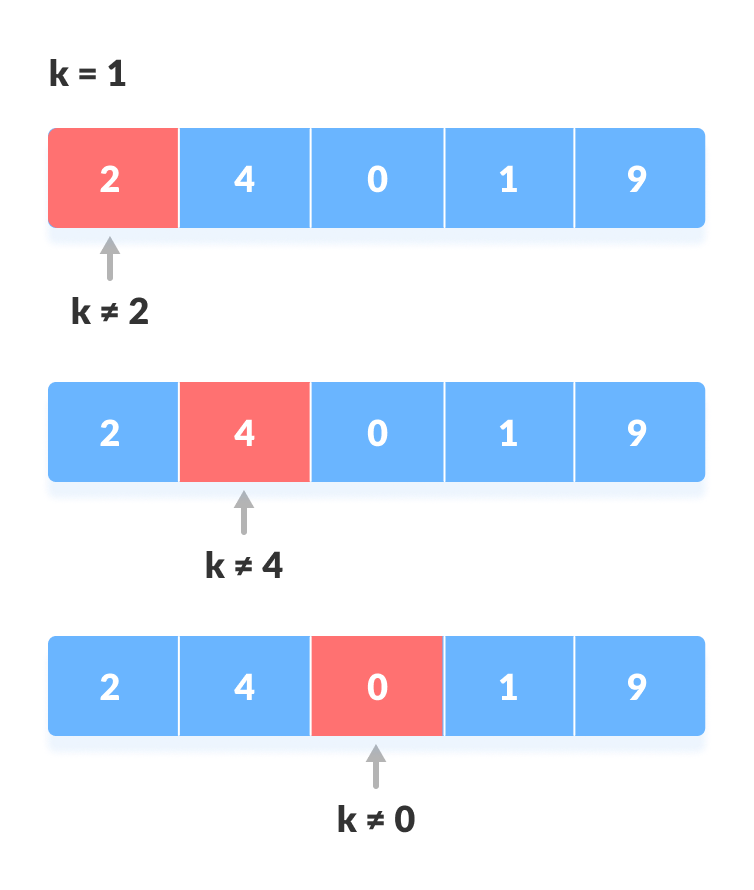

# Linear Search

**Linear search** is a sequential searching algorithm where we start from one end and check every element of the list until the desired element is found. It is the simplest searching algorithm.

---

### How Linear Search Works?

The following steps are followed to search for an element `k = 1` in the list below.

1. Start from the first element, compare `k` with each element `x`.

    
2. If `x == k`, return the index.

    
3. Else, return `not found`.

---

### Linear Search Algorithm

    LinearSearch(array, key)
        for each item in the array
            if item == value
                return its index

### Implementation

    int search(vector<int>& array, int n, int x) {
        for (int i = 0; i < n; i++)
            if (array[i] == x)
                return i;
        return -1;
    }
---

### Linear Search Complexities

**Time Complexity:** `O(N)`\
**Space Complexity:** `O(1)`

---
### Linear Search Applications
For searching operations in smaller arrays (<100 items).