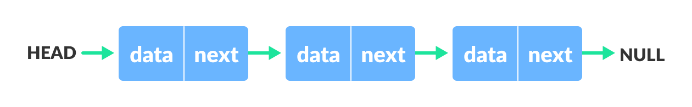

# Linked list Data Structure

A **linked list** is a linear data structure that includes a series of connected nodes. Here, each node stores the **data** and the **address** of the next node. For example,

You have to start somewhere, so we give the address of the first node a special name called `HEAD`. Also, the last node in the linked list can be identified because its next portion points to `NULL`.

Linked lists can be of multiple types: **singly**, **doubly**, and **circular linked list**.

> Note: You might have played the game Treasure Hunt, where each clue includes the information about the next clue. That is how the linked list operates.

---

### Representation of Linked List

Let's see how each node of the linked list is represented. Each node consists:

* A data item
* An address of another node

We wrap both the data item and the next node reference in a struct as:

    struct node
    {
        int data;
        struct node *next;
    };

Understanding the structure of a linked list node is the key to having a grasp on it.

Each struct node has a data item and a pointer to another struct node. Let us create a simple Linked List with three items to understand how this works.

    /* Initialize nodes */
    struct node *head;
    struct node *one = NULL;
    struct node *two = NULL;
    struct node *three = NULL;

    /* Allocate memory */
    one = malloc(sizeof(struct node));
    two = malloc(sizeof(struct node));
    three = malloc(sizeof(struct node));

    /* Assign data values */
    one->data = 1;
    two->data = 2;
    three->data=3;

    /* Connect nodes */
    one->next = two;
    two->next = three;
    three->next = NULL;

    /* Save address of first node in head */
    head = one;

In just a few steps, we have created a simple linked list with three nodes.

The power of a linked list comes from the ability to break the chain and rejoin it. E.g. if you wanted to put an element 4 between 1 and 2, the steps would be:

* Create a new struct node and allocate memory to it.
* Add its data value as 4
* Point its next pointer to the struct node containing 2 as the data value
* Change the next pointer of "1" to the node we just created.

Doing something similar in an array would have required shifting the positions of all the subsequent elements.

---

### Linked List Utility

Lists are one of the most popular and efficient data structures, with implementation in every programming language like C, C++, Python, Java, and C#.

Apart from that, linked lists are a great way to learn how pointers work. By practicing how to manipulate linked lists, you can prepare yourself to learn more advanced data structures like graphs and trees.

---

### Implementation

    struct ListNode {
        int val;
        ListNode *next;
        ListNode() : val(0), next(nullptr) {}
        ListNode(int x) : val(x), next(nullptr) {}
        ListNode(int x, ListNode *next) : val(x), next(next) {}
    };

---

### Linked List Complexity

Time Complexity

||Worst case|Average Case|
|---|---|---|
|**Search**| `O(N)`| `O(N)`|
|**Insert**| `O(1)`| `O(1)`|
|**Delete**| `O(1)`| `O(1)`|

Space Complexity: `O(N)`

---

### Linked List Applications

* Dynamic memory allocation
* Implemented in stack and queue
* In **undo** functionality of softwares
* Hash tables, Graphs