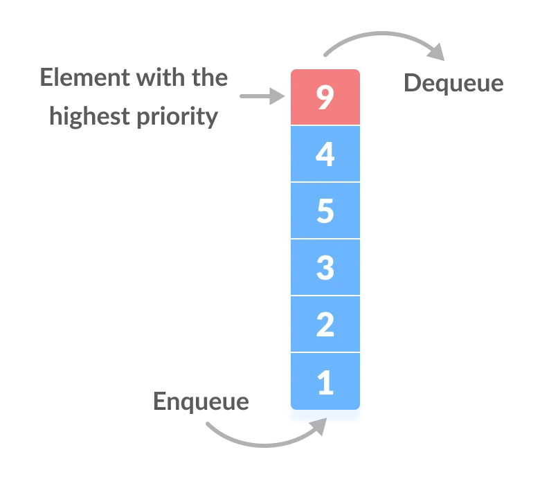
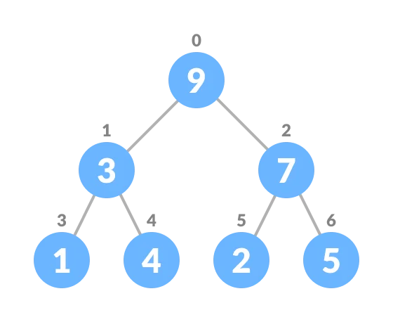
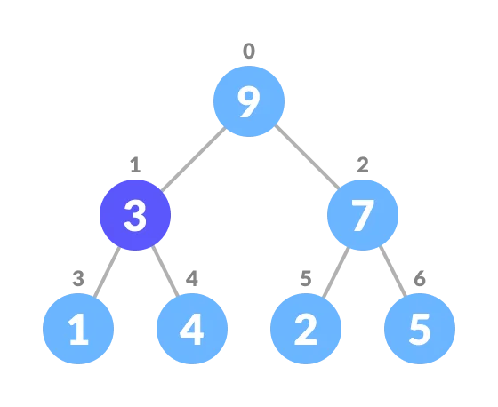
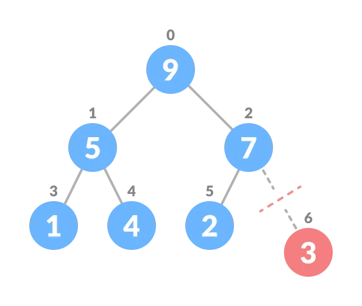

# Priority Queue

A **priority queue** is a **special type of queue** in which each element is associated with a **priority value**. And, elements are served on the basis of their priority. That is, higher priority elements are served first.

However, if elements with the same priority occur, they are served according to their order in the queue.

**Assigning Priority Value**

Generally, the value of the element itself is considered for assigning the priority. For example,

The element with the highest value is considered the highest priority element. However, in other cases, we can assume the element with the lowest value as the highest priority element.

We can also set priorities according to our needs.

---

### Difference between Priority Queue and Normal Queue

In a queue, the **first-in-first-out** rule is implemented whereas, in a priority queue, the values are removed **on the basis of priority**. The element with the highest priority is removed first.

---

### Implementation of Priority Queue

Priority queue can be implemented using an array, a linked list, a heap data structure, or a binary search tree. Among these data structures, heap data structure provides an efficient implementation of priority queues.

Hence, we will be using the heap data structure to implement the priority queue in this tutorial. A max-heap is implement is in the following operations. If you want to learn more about it, please visit [max-heap and mean-heap][1].

A comparative analysis of different implementations of priority queue is given below.

|Operations|peek|insert|delete|
|---|---|---|---|
|Linked List| `O(1)`| `O(N)`|`O(1)`|
|Binary Heap| `O(1)`| `O(log(N))`|`O(log(N))`|
|Binary Search Tree| `O(1)`| `O(log(N))`|`O(log(N))`|

---

### Priority Queue Operations

Basic operations of a priority queue are inserting, removing, and peeking elements.

> Before studying the priority queue, please refer to the [heap data structure][1] for a better understanding of binary heap as it is used to implement the priority queue in this article.

---

**1. Inserting an Element into the Priority Queue**

Inserting an element into a priority queue (max-heap) is done by the following steps.
* Insert the new element at the end of the tree.

* Heapify the tree.

Algorithm for insertion of an element into priority queue (max-heap)

    if there is no node, 
        create a newNode.
    else (a node is already present)
        insert the newNode at the end (last node from left to right.)
    
    heapify the array

For Min Heap, the above algorithm is modified so that `parentNode` is always smaller than `newNode`.

---

**2. Deleting an Element from the Priority Queue**

Deleting an element from a priority queue (max-heap) is done as follows:

* Select the element to be deleted.

* Swap it with the last element.

* Remove the last element.

* Heapify the tree.

Algorithm for deletion of an element in the priority queue (max-heap)

    if nodeToBeDeleted is the leafNode
        remove the node
    else swap nodeToBeDeleted with the lastLeafNode
        remove noteToBeDeleted
    
    heapify the array

For Min Heap, the above algorithm is modified so that the both `childNodes` are smaller than `currentNode`.

---

**3. Peeking from the Priority Queue (Find max/min)**

Peek operation returns the maximum element from Max Heap or minimum element from Min Heap without deleting the node.

For both Max heap and Min Heap

    return rootNode

---

**4. Extract-Max/Min from the Priority Queue**

Extract-Max returns the node with maximum value after removing it from a Max Heap whereas Extract-Min returns the node with minimum value after removing it from Min Heap.

---

### Implementation

    struct Heap {
        vector<int> heapTree;
        // Function to heapify the tree
        void heapify(int i) {
            // Find the largest among root, left child and right child
            int largest = i;
            int l = 2 * i + 1;
            int r = 2 * i + 2;
            if (l < heapTree.size() && heapTree[l] > heapTree[largest]) largest = l;
            if (r < heapTree.size() && heapTree[r] > heapTree[largest]) largest = r;

            // Swap and continue heapifying if root is not largest
            if (largest != i) {
                swap(heapTree[i], heapTree[largest]);
                heapify(largest);
            }
        }

        // Function to insert an element into the tree
        void insert(int num) {
            if (heapTree.size() == 0) heapTree.push_back(num);
            else {
                heapTree.push_back(num);
                for (int i = heapTree.size() / 2 - 1; i >= 0; i--) {
                    heapify(i);
                }
            }
        }

        // Function to delete an element from the tree
        void deleteNode(int num) {
            int i;
            for (i = 0; i < heapTree.size(); i++) {
                if (num == heapTree[i]) break;
            }
            swap(heapTree[i], heapTree[heapTree.size() - 1]);

            heapTree.pop_back();
            for (int i = heapTree.size() / 2 - 1; i >= 0; i--) {
                heapify(i);
            }
        }
    }

---

### Priority Queue Applications

Some of the applications of a priority queue are:

* Dijkstra's algorithm
* For implementing stack
* For load balancing and interrupt handling in an operating system
* For data compression in Huffman code
