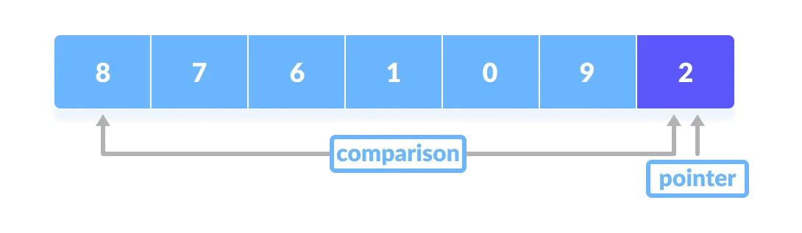
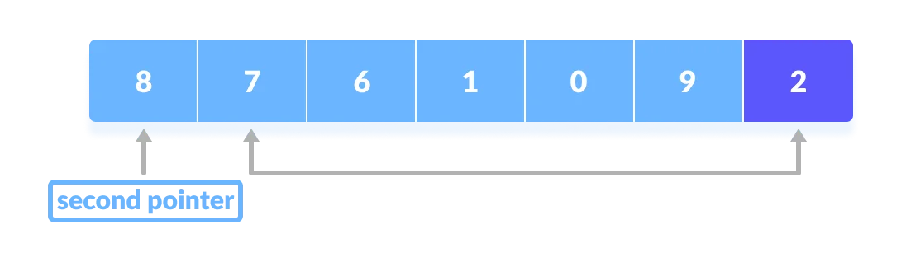
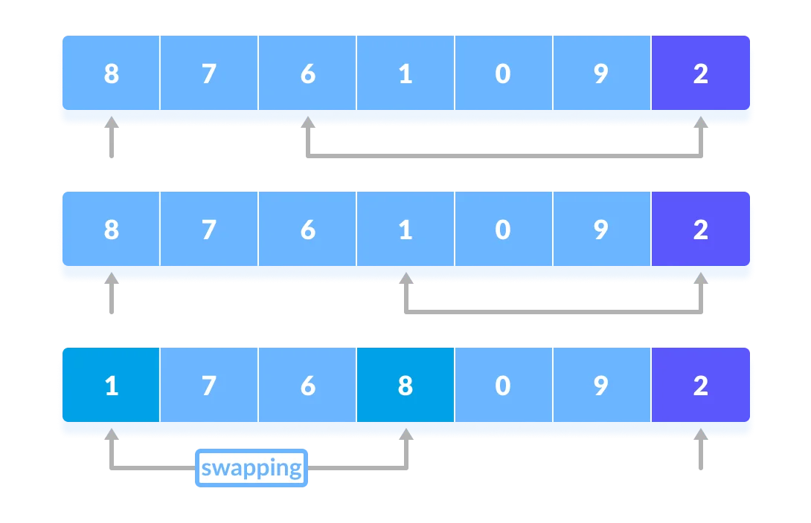
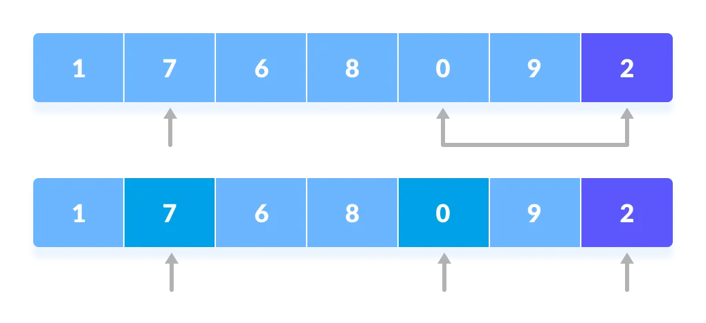
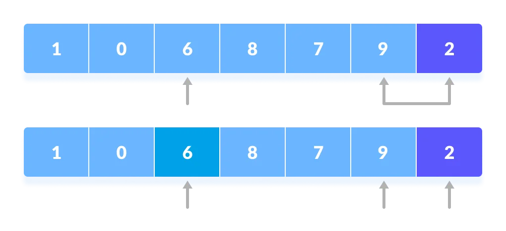
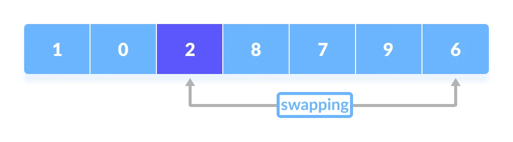
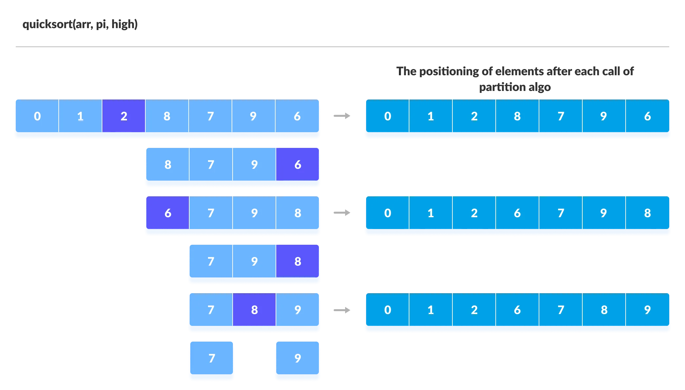
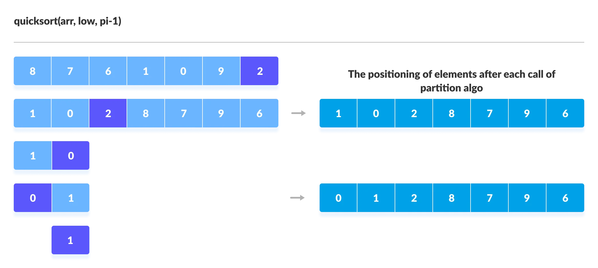

# Quicksort

**Quicksort** is a sorting algorithm based on the **divide and conquer approach** where

1. An array is divided into subarrays by selecting a **pivot element** (element selected from the array).

    While dividing the array, the pivot element should be positioned in such a way that elements less than pivot are kept on the left side and elements greater than pivot are on the right side of the pivot.

2. The left and right subarrays are also divided using the same approach. This process continues until each subarray contains a single element.

3. At this point, elements are already sorted. Finally, elements are combined to form a sorted array.

### Working of Quicksort

**1. Select the Pivot Element**

There are different variations of quicksort where the pivot element is selected from different positions. Here, we will be selecting the rightmost element of the array as the pivot element.

**2. Rearrange the Array**

Now the elements of the array are rearranged so that elements that are smaller than the pivot are put on the left and the elements greater than the pivot are put on the right.

Here's how we rearrange the array:

1. A pointer is fixed at the pivot element. The pivot element is compared with the elements beginning from the first index.

2. If the element is greater than the pivot element, a second pointer is set for that element.

3. Now, pivot is compared with other elements. If an element smaller than the pivot element is reached, the smaller element is swapped with the greater element found earlier.

4. Again, the process is repeated to set the next greater element as the second pointer. And, swap it with another smaller element.

5. The process goes on until the second last element is reached.

6. Finally, the pivot element is swapped with the second pointer.

**3. Divide Subarrays**

Pivot elements are again chosen for the left and the right sub-parts separately. And, **step 2** is repeated.

The subarrays are divided until each subarray is formed of a single element. At this point, the array is already sorted.

### Quick Sort Algorithm

    quickSort(array, leftmostIndex, rightmostIndex)
    if (leftmostIndex < rightmostIndex)
        pivotIndex <- partition(array,leftmostIndex, rightmostIndex)
        quickSort(array, leftmostIndex, pivotIndex - 1)
        quickSort(array, pivotIndex, rightmostIndex)

    partition(array, leftmostIndex, rightmostIndex)
    set rightmostIndex as pivotIndex
    storeIndex <- leftmostIndex - 1
    for i <- leftmostIndex + 1 to rightmostIndex
    if element[i] < pivotElement
        swap element[i] and element[storeIndex]
        storeIndex++
    swap pivotElement and element[storeIndex+1]
    return storeIndex + 1

### Visual Illustration of Quicksort Algorithm

You can understand the working of quicksort algorithm with the help of the illustrations below.

### Implementation

    // function to rearrange array (find the partition point)
    int partition(vector<int>& array, int low, int high) {  
        // select the rightmost element as pivot
        int pivot = array[high];
        
        // pointer for greater element
        int i = low - 1;

        // traverse each element of the array
        // compare them with the pivot
        for (int j = low; j < high; j++) {
            if (array[j] <= pivot) {    
                // if element smaller than pivot is found
                // swap it with the greater element pointed by i
                i++;
                
                // swap element at i with element at j
                swap(array[i], array[j]);
            }
        }
        
        // swap pivot with the greater element at i
        swap(array[i + 1], array[high]);
        
        // return the partition point
        return i + 1;
    }

    void quickSort(vector<int> array, int low, int high) {
        if (low < high) {
            // find the pivot element such that
            // elements smaller than pivot are on left of pivot
            // elements greater than pivot are on righ of pivot
            int pi = partition(array, low, high);

            // recursive call on the left of pivot
            quickSort(array, low, pi - 1);

            // recursive call on the right of pivot
            quickSort(array, pi + 1, high);
        }
    }

**Quick Sort Complexity**

|**Time Complexity** | |
|---|---|
|Best| *O*(N * log(N))|
|Worst| *O*(N^2|
|Average| *O*(N * log(N))|
|**Space Complexity**| *O*(log(N))|
|**Stability**| No|

**1. Time Complexities**

* **Worst Case Complexity [Big-O]:** `O(N^2)`

    It occurs when the pivot element picked is either the greatest or the smallest element.

    This condition leads to the case in which the pivot element lies in an extreme end of the sorted array. One sub-array is always empty and another sub-array contains `N - 1` elements. Thus, quicksort is called only on this sub-array.

    However, the quicksort algorithm has better performance for scattered pivots.

* **Best Case Complexity [Big-omega]:** `O(N*log(N))`

    It occurs when the pivot element is always the middle element or near to the middle element.

* **Average Case Complexity [Big-theta]:** `O(N*log(N))`

    It occurs when the above conditions do not occur.

**2. Space Complexity**

The space complexity for quicksort is `O(log(N))`.

---
**Quicksort Applications**

Quicksort algorithm is used when

* The programming language is good for recursion
* Time complexity matters
* Space complexity matters